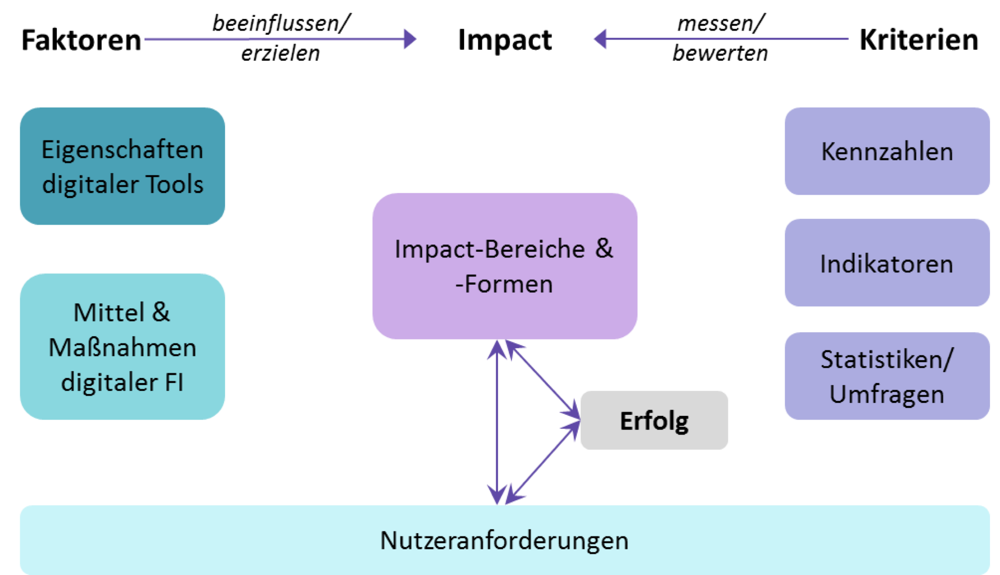

# Impactomatrix

"Wie können wir nachhaltigere Software und Infrastrukturen bauen?" – "Indem wir unter anderem offene Formate einsetzen und unterstützen."

"Können wir sehen, ob unser Projekt nachhaltig ist?" – "Ja, weil der Programmcode und unsere Forschungsergebnisse weiterverwendet werden!"

Die Impactomatrix ist eine interaktive Übersicht über das Zusammenspiel von Faktoren und Kriterien, die zur Messung von Impact von DH-Projekten und virtuellen Infrastrukturen benutzt werden kann.

[Zur Impactomatrix](https://dariah-de.github.io/Impactomatrix)
